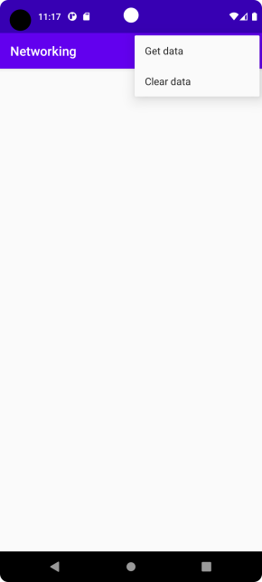
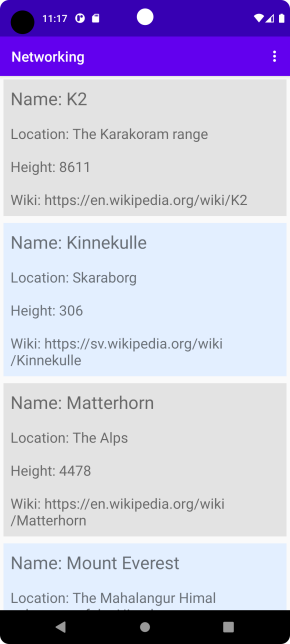

# Rapport

**Networking**

För att lösa denna uppgift så har jag skrivit ett program som laddar hem json-data ifrån https://mobprog.webug.se/json-api?login=brom för att sedan, med hjälp av gson biblioteket, tolka och överföra denna till Mountain-objekt. Dessa lagras sedan i en ArrayList&lt;Mountain&gt; och visas sedan upp i en RecyclerView. 

En RecyclerView används för att kunna återanvända View:s då man har mer data än man får plats med på skärmen. För att använda sig av en RecyclerView behöver man en adapter som definierar hur dataelement ska visas upp och hur dessa skall bindas till Views som utgör ett skärmelement. För detta ändamål skapades klassen MountainViewAdapter som utökar RecyclerView.Adapter. Här nedan ser vi konstruktorn till denna klass.

```
public class MountainViewAdapter extends RecyclerView.Adapter<MountainViewAdapter.MountainViewHolder> {

    Context context;
    ArrayList<Mountain> mountainArrayList;

    public MountainViewAdapter(Context context, ArrayList<Mountain> mountainArrayList) {
        this.context = context;
        this.mountainArrayList = mountainArrayList;
    }
    ...
```
Denna tar en Context och en ArrayList&lt;Mountain&gt; som argument. Dessa används för att binda adaptern till programmets MainActivity samt att göra datakällan, dvs. mountainArrayList som lagrar json-datan efter att den tolkats och omvandlats till Mountain-objekt, tillgänglig för adaptern. 

Vi har i denna definierat en inre klass MountainViewHolder som utökar RecyclerView.ViewHolder. Objekt av denna typ utgör ett skärmelement och varje skärmelement som visas i en RecyclerView svarar mot ett dataelement ifrån datakällan. I detta fall definierar den hur varje uppsättning data om ett berg kommer representeras på skärmen och som synes nedan innehåller den fyra TextView-medlemmar som alla svarar mot medlemmar i klassen Mountain.

```
public static class MountainViewHolder extends RecyclerView.ViewHolder {

        TextView mountainName;
        TextView mountainLocation;
        TextView mountainHeight;
        TextView mountainWiki;

        public MountainViewHolder(@NonNull View itemView) {
            super(itemView);
            mountainName = itemView.findViewById(R.id.mountainname);
            mountainLocation = itemView.findViewById(R.id.mountainlocation);
            mountainHeight = itemView.findViewById(R.id.mountainheight);
            mountainWiki = itemView.findViewById(R.id.mountainwiki);
        }
}
```

MountainViewAdapter kommer skapa tillräckligt med objekt av denna klass för att täcka skärmen. Varje gång ett nytt MountainViewHolder objekt behövs så anropas onCreateViewHolder(ViewGroup parent, int viewType) där parent är det RecyclerView-objekt som skall visa programmets data.

```
@Override
public MountainViewAdapter.MountainViewHolder onCreateViewHolder(ViewGroup parent, int viewType) {
        LayoutInflater inflater = LayoutInflater.from(context);
        View view = inflater.inflate(R.layout.recycler_layout, parent, false);

        return new MountainViewAdapter.MountainViewHolder(view);
}
``` 
inflater.inflate() anropas för att instantiera en layout som definierats i /res/layout/recycler_layout.xml, denna skickas sedan som argument till konstruktorn för MountainViewHolder, objektet returneras sedan för att finnas tillgångligt i våran RecyclerView. 

Ett MountainViewHolder-objekt innehåller direkt efter sin tillblevelse ingen data. Data kopplas till holder-objektet med metoden onBindViewHolder(MountainViewHolder holder, int position) som anropas av RecyclerView innan ett holder-objekt ska visas på skärmen.

```
@Override
public void onBindViewHolder(MountainViewHolder holder, int position) {
     holder.mountainName.setText("Name: " + mountainArrayList.get(position).getName());
     holder.mountainLocation.setText("Location: " + mountainArrayList.get(position).getLocation());
     holder.mountainHeight.setText("Height: " + mountainArrayList.get(position).getHeight() );
     holder.mountainWiki.setText("Wiki: " + mountainArrayList.get(position).auxdata.getWiki());

     if((position % 2) == 0) {
         holder.itemView.setBackgroundColor(context.getResources().getColor(R.color.lightgrey));
     }else{
         holder.itemView.setBackgroundColor(context.getResources().getColor(R.color.lightblue));
     }

}
```
Här sätts data för alla fyra TextView-element som finns i holder. Variabeln position används för att indexera i mountainArrayList, vilket avgör vilken data som skall bindas till objektet holder. Dess bakgrundsfärg sätts beroende på om dess position i datakällan är jämn eller ej.

Hämtningen av data som skall visas i programmets RecyclerView inleds genom att välja menyalternativet "Get data", när detta alternativ väljs så startas en separat tråd med hjälp av ett JsonTask i onOptionsItemSelected(MenuItem item).


 


```
@Override
public boolean onOptionsItemSelected(MenuItem item) {

    ...
   
    /* start JsonTask and fetch data */
    if (id == R.id.action_get_data) {
        Log.d("onOptionItemSelected","Get JSON data from web");
        /* get JSON data from webservice */

        new JsonTask(this).execute(JSON_URL);
        return true;
    }

   ...
}  
```

När hämtningen är klar så anropas onPostExecute() i vilken json-datan tolkas till Mountain-objekt via gson.fromJson() och placeras i en ArrayList&lt;Mountain&gt; med mountainArrayList.addAll(), därefter anropas mAdapter.notifyDataSetChanged() för att signalera till adaptern att datakällan ändrats och att dess ViewHolder-objekt måste updateras.


```
@Override
public void onPostExecute(String json) {
    /* parse json into Mountain objects */
    //mountainArrayList.clear();
    mountainArrayList.addAll(gson.fromJson(json, type));
    //Log.d("onPostExecute(): ", mountainArrayList.toString());
    mAdapter.notifyDataSetChanged();
}
```

Varje Mountain-objekt i mountainArrayList kommer därefter att visas enligt följande 



